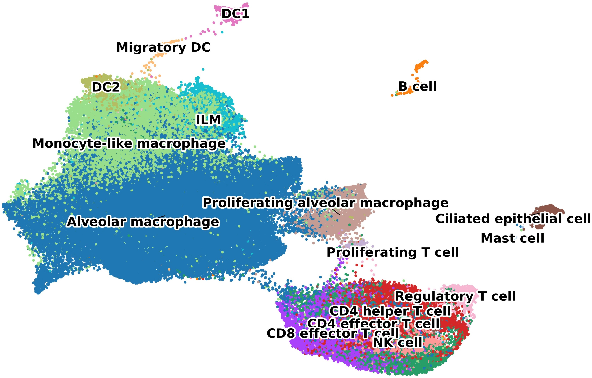
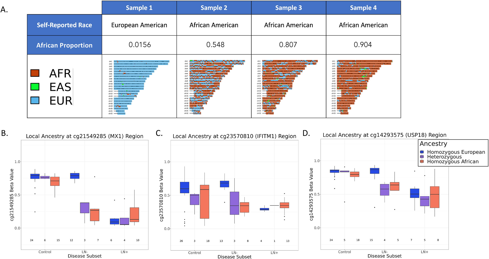
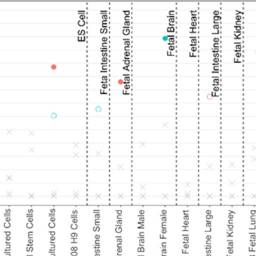

My research projects focus on the molecular underpinnings of respiratory and autoimmune diseases using multi-omics approaches.
All code and analysis pipelines are publicly available on [GitHub](https://github.com/PeterCAllen).

## Interstitial Lung Disease — BAL scRNA-seq (2025)

{width=200px style="float:right; margin-left:1.5rem; border-radius:8px;"}

Single-cell RNA sequencing of bronchoalveolar lavage (BAL) fluid from patients with interstitial lung disease (ILD).
This project characterises alveolar immune cell populations in pulmonary fibrosis and identifies novel transcriptomic signatures associated with disease progression.

**[View on GitHub →](https://github.com/PeterCAllen/ILD-BAL-scRNA-Manuscript-2025)**

 

---

## Systemic Lupus Erythematosus — Ancestry Methylation (2023)

{width=200px style="float:right; margin-left:1.5rem; border-radius:8px;"}

Genome-wide DNA methylation analysis of buffy coat samples from African American and European American cohorts with SLE and lupus nephritis.
Identified ancestry-specific epigenetic signatures and interferon pathway enrichment driving disease heterogeneity.

**[View on GitHub →](https://github.com/PeterCAllen/sle_ancestry_manuscript2023)**

 

---

## Scleroderma — Monocyte Methylation (2023)

{width=200px style="float:right; margin-left:1.5rem; border-radius:8px;"}

Genome-wide DNA methylation and gene expression profiling of classical monocytes in African American patients with systemic sclerosis (SSc).
Characterised distinct epigenetic signatures distinguishing SSc monocytes from healthy controls.

**[View on GitHub →](https://github.com/PeterCAllen/scleroderma_monocyte_analysis)**

 
